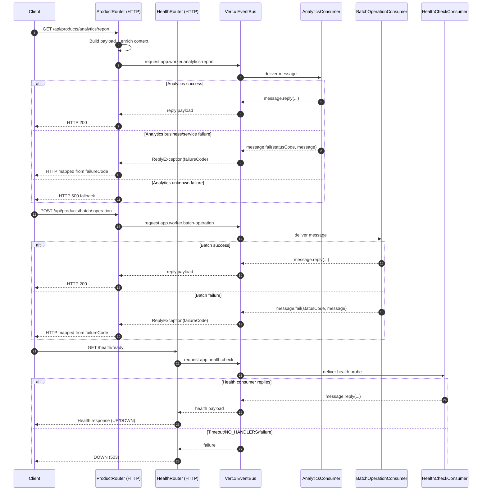

# Deep Dive: EventBus Interaction Pattern

**Type:** Interaction / Logic Documentation  
**Focus:** `AppVerticle` ↔ `WorkerVerticle` communication  
**Last Verified:** February 2026

## 1. Context

This project splits responsibilities:

- `AppVerticle`: HTTP request handling
- `WorkerVerticle`: async business workloads via EventBus consumers

This keeps HTTP event loop paths fast while pushing heavier logic to worker-side consumers.

## 2. Addresses in Current Use

- `app.worker.analytics-report`
- `app.worker.batch-operation`
- `app.health.check`
- `app.worker.operation` (legacy)

## 3. Workflow Diagram

Diagram notes:

- The same request/reply + failure-code mapping pattern is used by analytics and batch flows.
- Correlation context enrichment occurs before EventBus requests in publisher routes.
- Health readiness depends on `app.health.check` request/reply availability and timeout behavior.

## 4. HTTP → Worker Flow (Analytics)

### Publisher

- File: `src/main/java/com/github/kaivu/vertxweb/web/rests/ProductRouter.java`
- Endpoint: `GET /api/products/analytics/report`
- Action:
  1. Build request payload
  2. Enrich payload with correlation context (`_context`, `_correlationId`, `_requestId`)
  3. Send request/reply via EventBus to `app.worker.analytics-report`

### Consumer

- File: `src/main/java/com/github/kaivu/vertxweb/consumers/AnalyticsConsumer.java`
- Action:
  1. Rehydrate context from message body
  2. Validate request body
  3. Execute operation under analytics circuit breaker
  4. `message.reply(...)` on success or `message.fail(...)` on failure

## 5. HTTP → Worker Flow (Batch)

### Publisher

- File: `src/main/java/com/github/kaivu/vertxweb/web/rests/ProductRouter.java`
- Endpoint: `POST /api/products/batch/:operation`
- Address: `app.worker.batch-operation`

### Consumer

- File: `src/main/java/com/github/kaivu/vertxweb/consumers/BatchOperationConsumer.java`
- Valid operations: `insert`, `update`, `delete`, `migrate`
- Delete operation requires `confirmDelete=true`

## 6. Health Check EventBus Flow

- HTTP health router sends a probe to `app.health.check`
- `HealthCheckConsumer` replies with worker health/config readiness
- Readiness endpoint maps probe result to `UP` / `DOWN`

## 7. Failure Mapping

For request/reply flows:

- Consumer-side business/service errors should use `message.fail(statusCode, message)`
- HTTP-side caller maps `ReplyException.failureCode()` to HTTP status
- Unknown failures fall back to `500`

## 8. Context Propagation Contract

Current message enrichment keys:

- `_context` (full correlation object)
- `_correlationId`
- `_requestId`

If these are removed or renamed, worker-side trace continuity breaks.

## 9. Troubleshooting

| Symptom | Probable Cause | Check |
|---|---|---|
| `NO_HANDLERS` | consumer not registered / wrong address | `WorkerVerticle` registration + address constants |
| request timeout | worker delay or unavailable consumer | analytics timeout config + worker startup logs |
| missing correlation in worker logs | message was not enriched | publisher path before `eventBus().request(...)` |
| wrong HTTP status on worker error | failure-code mapping not preserved | `ReplyException.failureCode()` branch in router |
