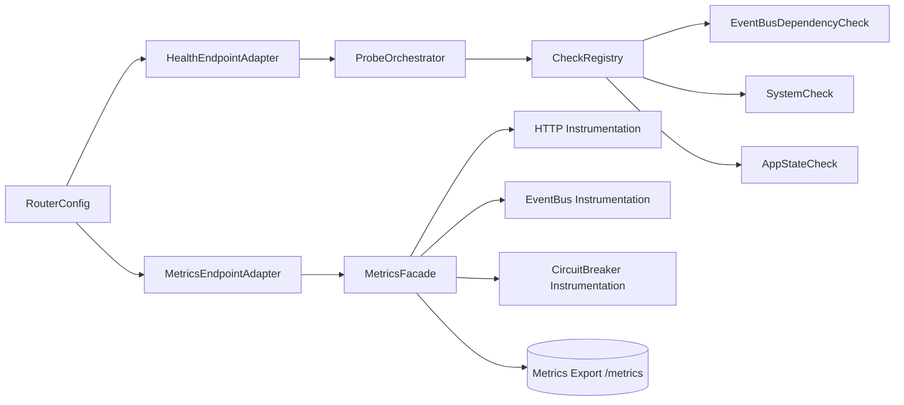

# Feature Architecture: Observability (Health + Metrics)

**Status:** Proposed  
**Context:** Vert.x + Guice demo service (`StartupApp`, `RouterConfig`, `HealthRouter`)  
**Date:** February 12, 2026

## 1. Scope

Design a long-term observability feature architecture that improves health probing and metrics export while fitting the current codebase.

In scope:
1. Health model and probe endpoints
2. Metrics model and scrape endpoints
3. Component interfaces and integration boundaries
4. Configuration model
5. Rollout and compatibility strategy

Out of scope:
1. Full implementation code
2. Infrastructure deployment manifests
3. Dashboard/alert content specifics

## 2. Design Drivers

1. Keep Vert.x event loop safe (non-blocking checks and instrumentation)
2. Preserve existing endpoints during migration
3. Improve operational signal quality for readiness and failure triage
4. Avoid adopting deprecated metrics implementation for new long-term work

## 3. Source-Based Constraints

1. Current health is custom in `HealthRouter` (`/health*` paths).
2. Current stack is Guice-based, not CDI-based runtime wiring.
3. `smallrye-health` is active and current:
   - https://github.com/smallrye/smallrye-health
4. `smallrye-metrics` is archived and deprecated (archived on November 24, 2025):
   - https://github.com/smallrye/smallrye-metrics

## 4. Architecture Decisions

## 4.1 Health Technology

**Decision:** Use SmallRye Health concepts/output as the canonical health model.

Rationale:
1. Standard liveness/readiness/startup semantics
2. Ecosystem compatibility for probe consumers
3. Reusable check registry/check abstraction patterns

## 4.2 Metrics Technology

**Decision:** Lock metrics backend to `Micrometer` for this project phase.

Rationale:
1. `smallrye-metrics` is deprecated/archived
2. Micrometer aligns best with current JVM ecosystem tooling and straightforward Prometheus export
3. Keeps integration simple for Vert.x + Guice runtime

Future direction:
1. OpenTelemetry remains a future export/integration path, not the primary metrics API in this phase

## 4.3 Endpoint Compatibility

**Decision:** Keep existing health routes and add canonical probe aliases.

Rationale:
1. Avoid breaking existing scripts and demos
2. Allow phased migration toward canonical contracts

## 4.4 Runtime Integration Mode

**Decision:** Implement health/metrics via framework-neutral adapters in Guice runtime (no CDI dependency at runtime).

Rationale:
1. Current application runtime is Guice-based
2. Avoids hidden CDI lifecycle assumptions and integration blockers
3. Keeps architecture portable and testable

## 5. Target Component Architecture



### Component Responsibilities

1. `HealthEndpointAdapter`
- Exposes `/health`, `/health/live`, `/health/ready`, `/health/started`
- Preserves `/health/liveness`, `/health/readiness`, `/health/detailed` for compatibility

2. `ProbeOrchestrator`
- Runs checks concurrently with timeout budget
- Aggregates status to canonical health payload

3. `CheckRegistry`
- Registers named checks by type: `liveness`, `readiness`, `startup`
- Supports dynamic registration for future modules

4. `MetricsFacade`
- Owns metric names, labels/tags, and writer API
- Bridges instrumentation from HTTP, EventBus, and circuit breaker modules

## 6. API Specification

## 6.1 Health Endpoints

1. `GET /health`
- Aggregate status
- Group composition is strict: `overall = readiness + startup` (liveness excluded)
- 200 when all readiness + startup checks are `UP`
- 503 when any readiness or startup check is `DOWN`

2. `GET /health/live`
- Process liveness only
- Should remain lightweight and local-only

3. `GET /health/ready`
- Readiness checks including EventBus dependency
- Represents traffic acceptance state

4. `GET /health/started`
- Startup gate (UP only after verticles and required consumers are ready)

5. Compatibility aliases:
- `GET /health/liveness` -> alias of `/health/live`
- `GET /health/readiness` -> alias of `/health/ready`
- `GET /health/detailed` -> optional extended payload, configurable exposure

### Health Response Contract

```json
{
  "status": "UP",
  "checks": [
    {
      "name": "eventbus",
      "status": "UP",
      "data": {
        "responseTimeMs": 3
      }
    }
  ]
}
```

### Health Group Composition (Strict)

1. `live`
- Contains only process-liveness checks
- Must not include external dependencies

2. `ready`
- Contains dependency and traffic-readiness checks (for example EventBus dependency check)

3. `started`
- Contains startup-completion checks (for example verticle/consumer registration completed)

4. `overall`
- Exactly `ready + started`
- Explicitly excludes `live`

## 6.2 Metrics Endpoints

1. `GET /metrics`
- Prometheus/OpenMetrics text output
- Default exposure in non-demo profiles: protected

2. Optional: `GET /metrics/json` (debug-only)
- JSON view for local debugging

### Initial Metrics Set

1. HTTP
- `http_server_requests_total{method,route,status}`
- `http_server_request_duration_ms{method,route,status}`

2. EventBus
- `eventbus_requests_total{address,outcome}`
- `eventbus_request_duration_ms{address,outcome}`

3. Circuit Breaker
- `circuit_breaker_state{breaker,state}`
- `circuit_breaker_transitions_total{breaker,from,to}`
- `circuit_breaker_failures_total{breaker,type}`

4. Process/JVM baseline
- uptime, heap usage, thread counts (via provider defaults or adapters)

## 7. Interface Design

## 7.1 Health

```java
public interface HealthCheck {
    String name();
    CheckType type(); // LIVENESS, READINESS, STARTUP
    Uni<CheckResult> execute();
}
```

```java
public interface ProbeOrchestrator {
    Uni<HealthPayload> live();
    Uni<HealthPayload> ready();
    Uni<HealthPayload> started();
    Uni<HealthPayload> overall();
}
```

## 7.2 Metrics

```java
public interface MetricsFacade {
    void recordHttpRequest(String route, String method, int status, long durationMs);
    void recordEventBusRequest(String address, String outcome, long durationMs);
    void recordCircuitBreakerTransition(String breaker, String from, String to);
    void recordCircuitBreakerFailure(String breaker, String type);
}
```

## 8. Configuration Design

Add new configuration section:

```yaml
app:
  observability:
    health:
      enable: true
      expose-detailed: true
      check-timeout-ms: 1000
      legacy-aliases: true
    metrics:
      enable: true
      backend: micrometer
      endpoint-path: /metrics
      exposure: protected # protected|open
      include-jvm: true
      include-system: true
```

Required behavior:
1. Can disable health or metrics independently
2. Detailed payload exposure can be disabled in prod
3. Endpoint path is configurable
4. Metrics exposure defaults to `protected` for non-demo profiles

## 9. Security and Exposure Model

1. Health liveness/readiness should be callable by orchestrator probes.
2. Detailed health should be gated by config and environment.
3. Metrics endpoint default policy:
   - non-demo profiles: protected
   - demo/local profile: optional open mode
4. Protected mode can be satisfied by one or more controls:
   - auth-protected endpoint
   - network/IP restriction
   - ingress-level access policy

## 10. Rollout Plan

## Phase 1: Foundation
1. Add observability config model
2. Introduce health/metrics abstraction interfaces
3. Keep existing `HealthRouter` behavior unchanged

## Phase 2: Dual-Path Exposure
1. Add canonical health endpoints and map legacy aliases
2. Add `/metrics` export with baseline HTTP/EventBus instrumentation
3. Start emitting circuit breaker metrics

## Phase 3: Cutover and Hardening
1. Make canonical endpoints primary in docs
2. Restrict detailed/metrics exposure per environment
3. Add regression tests for probe semantics and metric output

## 11. Test Strategy Requirements

1. Unit tests
- Probe aggregation logic
- Failure-to-status mapping
- Circuit breaker metric classification

2. Integration tests
- Endpoint contract tests for all health routes
- `/metrics` scrape shape and key metric presence

3. Non-functional tests
- Load test for health and metrics endpoints
- Verify no event-loop blocking in checks

## 12. Risks and Mitigations

1. Risk: CDI-centric examples do not map directly to Guice runtime.
- Mitigation: keep framework-neutral interfaces and adapter layer.

2. Risk: metric cardinality explosion (`route`, `address` tags).
- Mitigation: normalize routes and cap high-cardinality labels.

3. Risk: exposing too much diagnostic detail in production.
- Mitigation: strict config gating for detailed fields.

## 13. Approval Checklist

1. Confirm compatibility period for legacy health aliases:
- keep indefinitely or deprecate after target date
2. Confirm target date (if any) for introducing OTel exporter in a future phase
